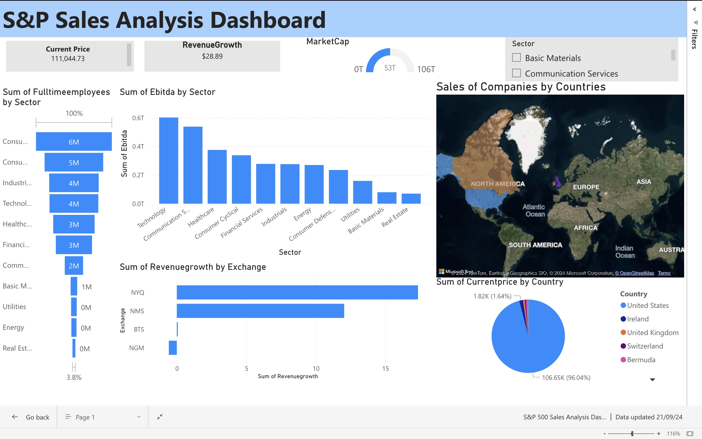

# time-series-analysis---visualize-in-Power-BI-dashboard
# Time Series Analysis of S&P Stock Prices

## Overview

This project analyzes the S&P 500 stock prices using three different time series forecasting models: **ARIMA**, **LSTM**, and **Prophet**. The dataset was obtained from **Kaggle** and the models were implemented in **Python** using **Google Colab**. The results are visualized in an interactive **Power BI** dashboard for further insights.

## PowerBI Dashboard Screenshot

Here’s a preview of the Excel VBA healthcare dashboard:



## Project Features

- **ARIMA Model**: A traditional time series forecasting model that captures trend, seasonality, and noise in the dataset.
- **LSTM Model**: A deep learning model capable of capturing long-term dependencies in time series data.
- **Prophet Model**: A model developed by Facebook for time series forecasting that works well with seasonal data.
- **Visualization**: Power BI dashboard to visualize predictions and actual stock prices across the different models.

## Dataset

- **Source**: The dataset was sourced from [Kaggle](https://www.kaggle.com/), containing daily historical stock prices of the S&P 500.
- **Description**: The dataset contains historical stock prices, with features such as `Date`, `Open`, `High`, `Low`, `Close`, `Volume`, and `Adjusted Close` prices.

## Project Structure

```plaintext
Time-Series-S&P-Stock-Analysis/
│
├── data/                                 # Folder for dataset (not included due to size)
│   └── sp500_stock_data.csv              # CSV file with S&P 500 stock data from Kaggle
├── models/                               # Folder for model-related scripts
│   ├── arima_model.ipynb                 # ARIMA model implementation in Python
│   ├── lstm_model.ipynb                  # LSTM model implementation in Python
│   └── prophet_model.ipynb               # Prophet model implementation in Python
├── visualizations/                       # Folder for visualizations and Power BI files
│   ├── sp500_power_bi_dashboard.pbix     # Power BI dashboard file
│   ├── sp500_dashboard_screenshot.png    # Screenshot of the Power BI dashboard
├── README.md                             # Project documentation (this file)
└── .gitignore                            # Specifies files to ignore (optional)
```
## Models
- ARIMA (Auto-Regressive Integrated Moving Average)
The ARIMA model is a statistical analysis model that uses time series data to predict future points. It captures autocorrelations in the data to make predictions.
Implementation: The ARIMA model was implemented in a Google Colab notebook, making use of the statsmodels library.

- LSTM (Long Short-Term Memory)
LSTM is a recurrent neural network (RNN) architecture that excels at capturing long-term dependencies in sequential data, making it ideal for time series forecasting.
Implementation: The LSTM model was developed using the TensorFlow and Keras libraries in Python.

- Prophet
Prophet is an open-source forecasting tool developed by Facebook. It is designed for time series forecasting with strong seasonal trends and multiple seasonality levels.
Implementation: The Prophet model was implemented using the fbprophet library in Python.

- Visualization
The Power BI dashboard provides interactive visualizations to compare the actual and predicted stock prices to understand Power BI dashboards

## Acknowledgements
- Kaggle: For providing the S&P stock prices dataset.
- Google Colab: For offering a free and powerful cloud-based Python environment.
- Facebook Prophet: For developing the Prophet model used in this project.

